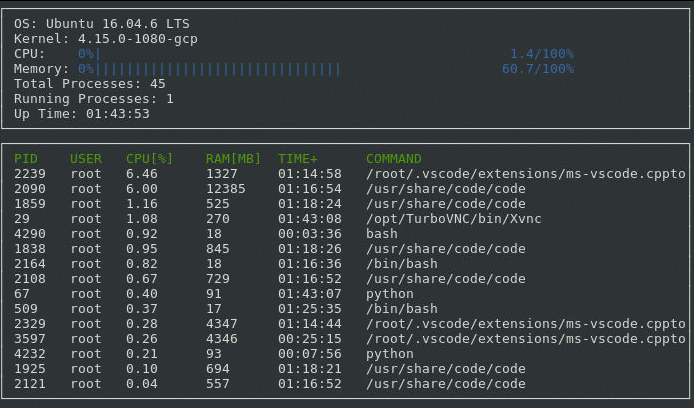

# Linux System Monitor App using C++

The goal of the project is to create an [Htop](https://htop.dev/) like system monitor for Linux. 
I am building the app using the starter code for the System Monitor Project in the [Udacity C++ Nanodegree Program](https://github.com/udacity/CppND-System-Monitor-Project-Updated.git). At the moment my implementation looks like this

## Dependencies 

The app codebase was tested in the Udacity browser-based Linux [Workspace](https://engineering.udacity.com/creating-a-gpu-enhanced-virtual-desktop-for-udacity-497bdd91a505). The specs are shown in the image above.  

**TODO** *Update this to reflect dependencies in local machine.*  

From the starter code for the project in [Udacity](https://github.com/udacity/CppND-System-Monitor-Project-Updated.git`).

## ncurses
[ncurses](https://www.gnu.org/software/ncurses/) is a library that facilitates text-based graphical output in the terminal. This project relies on ncurses for display output.

Within the Udacity Workspace, `.student_bashrc` automatically installs ncurses every time you launch the Workspace.

If you are not using the Workspace, install ncurses within your own Linux environment: `sudo apt install libncurses5-dev libncursesw5-dev`

## Make
This project uses [Make](https://www.gnu.org/software/make/). The Makefile has four targets:
* `build` compiles the source code and generates an executable
* `format` applies [ClangFormat](https://clang.llvm.org/docs/ClangFormat.html) to style the source code
* `debug` compiles the source code and generates an executable, including debugging symbols
* `clean` deletes the `build/` directory, including all of the build artifacts

## Instructions

1. Clone the project repository: `git clone https://github.com/udacity/CppND-System-Monitor-Project-Updated.git`

2. Build the project: `make build`

3. Run the resulting executable: `./build/monitor`

4. Follow along with the lesson.

5. Implement the `System`, `Process`, and `Processor` classes, as well as functions within the `LinuxParser` namespace.

6. Submit!